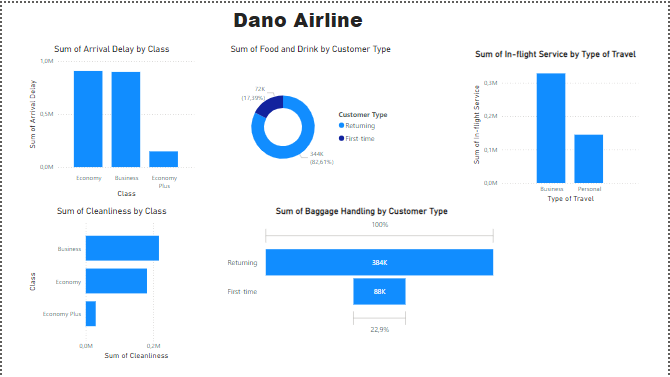

# Digitaley-Bootcamp
Data analysis project
# Dano_Airline

## Introduction

Dano Airlines, a Uk-based airline
headquartered in London, United Kingdom. The latest passenger survey results just came in and it looks
like the satisfaction rate dipped under 50% for the first time ever. The leadership team needs to take
action fast, so they've brought you in to analyze the data and find the key areas to focus on for getting
back on track.

**_ Disclaimer**_: _ All dataset does not represent any company but just a dummy datasets to demonstarate capabilities of Excel, Power BI._

# Problem Statement

 Question 1.
Which airplane class has the highest arrival delay between the 3 and which has the lowest?

Question 2.
Which customer type is more satisfied with the food and drink services of the airplane?

Question 3.
Which type of travel is more satisfied with the airplane service as a whole?

Question 4.
Which class has the most clean airplane while travelling?

Question 5.
Which Customer type is more satisfied with the luggage handling services?

# Skill

- Ms Excel
- Pivot Table
- Charts
- Map
- Power Query
- Data Modeling
- Data Cleaning
- Data Visualization etc.,

# Modeling

## II

# Analysis

-  1. Economy and business class have the highest arrival delay while economy plus has the lowest arrival delays.

-  2. The returning customers are more satisfied with the food and drinks in the plane.

-  3. The business type of travel.
 
-  4. First class.
 
- 5. The returning customer.

  Click [here](https://docs.google.com/spreadsheets/d/15Kp-2yfQFNRGJPNOkpMwG-OMX8xVZOJ5VL7f35v7sR
Q/edit#gid=1647986900) to interact with the datasets.

 # Conclusion

 The datasets of the previous year will be required for comparison and data driven decision.
