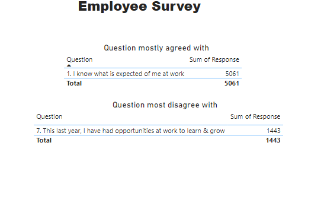

# Digitaley-Bootcamp
Data analysis project
# Employee Survey

## Introduction

The Employee Survey Responses are actual responses from an employee engagement survey conducted
by Pierce County WA and completed voluntarily by government employees. The dataset is a Single table
and contains 14,725 records. The total number of fields is 10.

**_ Disclaimer**_: _ All dataset does not represent any company but just a dummy datasets to demonstarate capabilities of Excel, Power BI._

# Problem Statement

 Question 1.
Which survey questions did respondents agree with or disagree with most?

Question 2.
Do you see any patterns or trends by department or role?

Question 3.
As an employer, what steps might you take to improve employee satisfaction based on the survey
results?

# Skill

- Ms Excel
- Pivot Table
- Charts
- Power Query
- Data Modeling
- Data Cleaning
- Data Visualization etc.,

# Modeling

## II

# Analysis

-  1. The question that most participants agreed with " I know what is expected of me at work" and the one question where most participants disagreed on was "This last year, i had the opportunities at work to learn & grow".
 
- 2. The Treands i see by department is that the directors and managers most of them did not participate in the survey.
 
- 3. I would develop my employees by allowing them to further their studies and grow from the current positions they are at.

  Click [here](https://docs.google.com/spreadsheets/d/1nbhfp2ModgqDAPveYQG9CknRw2PYJQxbOTs3xSKOB
8E/edit#gid=61186505) to interact with the datasets.

 # Conclusion

 The datasets of the previous year will be required for comparison and data driven decision.
