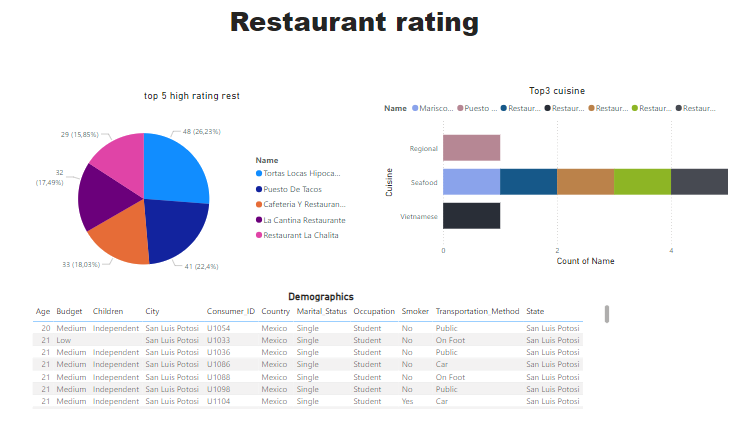

# Digitaley-Bootcamp
Data analysis project
# Restaurant_Rating

## Introduction

This data set is called the restaurant rating dataset which contains information about restaurants in
mexico. A customer survey was carried out in this city in 2012 to collate information about each
restaurant, their cuisines, information about their consumers and the preferences of the consumers.
There are other additional information you will find in this dataset when exploring it.

**_ Disclaimer**_: _ All dataset does not represent any company but just a dummy datasets to demonstarate capabilities of Excel, Power BI._

# Problem Statement

 Question 1.
What can you learn from the highest rated restaurants? Do consumer preferences have an effect on
ratings?

Question 2.
What are the consumer demographics? Does this indicate a bias in the data sample?

Question 3.
Are there any demand & supply gaps that you can exploit in the market?

Question 4.
If you were to invest in a restaurant, which characteristics would you be looking for?

# Skill

- Ms Excel
- Pivot Table
- Charts
- Map
- Power Query
- Data Modeling
- Data Cleaning
- Data Visualization etc.,

# Modeling

## II

# Analysis

-  1. highest ratings dont only include food ratings but  customer service is also important. customer's say have a great impact in the growth of any business.

-  2. The demographics are shown on the data modelling dashboard. Yes it is bias.

-  3. So far all looks good.
 
-  4. I would go for the top 3 cuisine most people enjoy and take it from there.

  Click [here](https://drive.google.com/file/d/1c1HKM8UTqwWOgexRLOtEJuxjBiA2N6xf/view?usp=drive_link) to interact with the datasets.

 # Conclusion

 The datasets of the previous year will be required for comparison and data driven decision.
